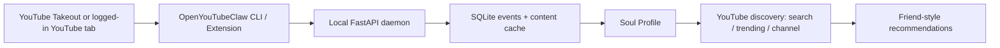

# ? OpenYouTubeClaw

OpenYouTubeClaw is a YouTube-only fork of OpenBiliClaw. It keeps the local-first Soul Profile, recommendation engine, FastAPI daemon, SQLite storage, and browser extension, while making YouTube the only default content source.



## Quick start

```bash
pip install -e .
copy config.example.toml config.toml
openyoutubeclaw start
openyoutubeclaw import-youtube ./takeout.zip
# or: openyoutubeclaw fetch-youtube
openyoutubeclaw rebuild-profile --source youtube
openyoutubeclaw discover --source youtube
openyoutubeclaw recommend
```

## YouTube sources

- Google Takeout watch history, subscriptions, and liked videos.
- Browser-extension bootstrap for `/feed/history`, `/feed/channels`, and liked videos.
- Discovery strategies: `yt_search`, `yt_trending`, and `yt_channel`.

## Privacy

All profile, memory, and recommendation data stays on your machine unless you configure an external LLM provider.
