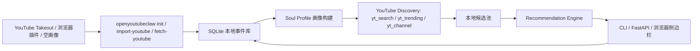

# ▶ OpenYouTubeClaw

> YouTube 专用的本地 AI 推荐 Agent。导入 YouTube 观看、订阅、点赞等信号，在本机生成兴趣画像、发现候选视频，并给出可解释推荐。

[English README](README_EN.md) · [文档导航](docs/index.md) · [配置参考](docs/modules/config.md) · [CLI 参考](docs/modules/cli.md)

## 这是什么

OpenYouTubeClaw 是从 OpenBiliClaw 硬分叉出来的 YouTube-only 项目。第一阶段仍复用内部 Python 包名 `openbiliclaw`，但公开产品名、命令行入口、配置样例、浏览器插件和文档都以 `OpenYouTubeClaw / openyoutubeclaw` 为主路径。

适合场景：

- 想把 YouTube Takeout 或浏览器采集到的行为沉淀成本地兴趣画像。
- 想用自己的 LLM / 本地模型解释“为什么推荐这条视频”。
- 想在不扩大浏览器权限的前提下，只围绕 YouTube 做推荐实验。

## 当前数据流



## 1. 安装

### Windows

```powershell
git clone https://github.com/stein114514/OpenYouTubeClaw.git
cd OpenYouTubeClaw
python -m venv .venv
.\.venv\Scripts\Activate.ps1
pip install -e ".[dev]"
copy config.example.toml config.toml
```

### macOS / Linux

```bash
git clone https://github.com/stein114514/OpenYouTubeClaw.git
cd OpenYouTubeClaw
python3 -m venv .venv
source .venv/bin/activate
pip install -e ".[dev]"
cp config.example.toml config.toml
```

## 2. 配置 LLM

编辑 `config.toml`，至少补齐一个 provider：

```toml
[llm]
provider = "openai"
api_key = "你的 API Key"
model = "gpt-4o-mini"

[sources.youtube]
enabled = true

[scheduler.pool_source_shares]
youtube = 1
```

如果使用 Ollama，请先启动 Ollama 服务，并把 provider 改成 `ollama`。不要提交真实 API Key、Takeout 文件、Cookie 或数据库文件。

## 3. 初始化 YouTube 画像

> **Docker / Agent 安装**：后端容器启动后会自动运行 init，无需手动执行此步骤。

三种方式任选一种。

### A. Google Takeout（推荐）

1. 打开 [Google Takeout](https://takeout.google.com/)。
2. 只选择 **YouTube and YouTube Music**。
3. 导出后下载压缩包。
4. 执行：

```powershell
openyoutubeclaw init --youtube-takeout .\takeout.zip
# 或者分步执行
openyoutubeclaw import-youtube .\takeout.zip
openyoutubeclaw rebuild-profile --source youtube
```

### B. 浏览器插件采集

```powershell
cd extension
npm install
npm run build
```

然后在 Chrome / Edge 中：

1. 打开 `chrome://extensions` 或 `edge://extensions`。
2. 开启“开发者模式”。
3. 点击“加载已解压的扩展程序”。
4. 选择项目里的 `extension/` 目录。
5. 登录 YouTube，并启动本地后端：

```powershell
openyoutubeclaw start
openyoutubeclaw init --youtube-browser
openyoutubeclaw fetch-youtube
```

### C. 空画像启动

```powershell
openyoutubeclaw init --empty-profile
```

## 4. 常用命令

| 命令 | 用途 |
| --- | --- |
| `openyoutubeclaw start` | 启动本地后端、调度器和 API。 |
| `openyoutubeclaw serve-api --host 127.0.0.1 --port 8420` | 只启动 API 服务，便于插件连接。 |
| `openyoutubeclaw import-youtube ./takeout.zip` | 导入 Google Takeout。 |
| `openyoutubeclaw fetch-youtube` | 拉取浏览器插件采集的 YouTube 任务结果。 |
| `openyoutubeclaw rebuild-profile --source youtube` | 用 YouTube 事件重建画像。 |
| `openyoutubeclaw discover --source youtube --limit 10` | 发现 YouTube 候选内容。 |
| `openyoutubeclaw recommend --limit 10` | 生成推荐列表和推荐理由。 |
| `openyoutubeclaw profile` | 查看当前画像摘要。 |
| `openyoutubeclaw chat "我今天想看轻松一点的视频"` | 与本地画像聊天。 |
| `openyoutubeclaw config-show` | 检查配置是否生效。 |

常见完整流程：

```powershell
openyoutubeclaw import-youtube .\takeout.zip
openyoutubeclaw rebuild-profile --source youtube
openyoutubeclaw discover --source youtube --limit 20
openyoutubeclaw recommend --limit 10
```

## 5. 浏览器插件与双语界面

插件已改为 YouTube 专用，并提供中文 / English 界面切换：

- 只注入 `*.youtube.com/*`。
- 只连接 `localhost` / `127.0.0.1` 后端。
- 侧边栏顶部可在“中文 / English”之间切换。
- 不再请求 Bilibili / 小红书 / 抖音站点权限。

插件开发验证：

```powershell
cd extension
npm test
npm run typecheck
npm run build
```

## 6. 故障排查

| 问题 | 处理方式 |
| --- | --- |
| `openyoutubeclaw` 命令找不到 | 确认已激活虚拟环境，并重新执行 `pip install -e ".[dev]"`。 |
| 插件显示后端未连接 | 先运行 `openyoutubeclaw start` 或 `openyoutubeclaw serve-api --port 8420`。 |
| 推荐为空 | 依次执行 `rebuild-profile`、`discover --source youtube --limit 20`、`recommend`。 |
| Takeout 导入不到数据 | 确认导出内容包含 YouTube 历史、订阅或点赞记录。 |
| LLM 报错 | 用 `openyoutubeclaw config-show` 检查 provider、model、api_key 和 base_url。 |

## 7. 开发检查

```powershell
pytest tests/test_config.py tests/test_source_policy.py tests/test_youtube_discovery_strategy.py
pytest tests/test_refresh_runtime.py tests/test_cli.py
ruff check src/ tests/
mypy src/
cd extension
npm test
npm run typecheck
npm run build
```

## 8. 隐私边界

- 核心数据默认保存在本机 SQLite 与数据目录中。
- YouTube Takeout、API Key、Cookie、数据库文件不要提交到仓库。
- 如果使用云端 LLM，画像与推荐所需的文本摘要会发送给你配置的 provider；如需完全本地化，请使用 Ollama 或兼容的本地模型服务。
