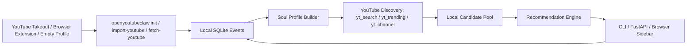

# ? OpenYouTubeClaw

[中文说明](README.md)

OpenYouTubeClaw is a YouTube-only local AI recommendation agent. It imports YouTube signals, builds a local Soul Profile, discovers candidate videos, and explains recommendations through your configured LLM.

## Architecture



## Install

```bash
git clone https://github.com/stein114514/OpenYouTubeClaw.git
cd OpenYouTubeClaw
python -m venv .venv
# Windows: .\.venv\Scripts\Activate.ps1
source .venv/bin/activate
pip install -e ".[dev]"
cp config.example.toml config.toml
```

Edit `config.toml` and configure your LLM provider. YouTube is the only enabled source by default:

```toml
[sources.youtube]
enabled = true

[scheduler.pool_source_shares]
youtube = 1
```

## Initialize your profile

Recommended Google Takeout path:

```bash
openyoutubeclaw init --youtube-takeout ./takeout.zip
# or step by step
openyoutubeclaw import-youtube ./takeout.zip
openyoutubeclaw rebuild-profile --source youtube
```

Browser extension path:

```bash
cd extension
npm install
npm run build
# Load extension/ as an unpacked extension, sign in to YouTube, then:
openyoutubeclaw start
openyoutubeclaw init --youtube-browser
openyoutubeclaw fetch-youtube
```

Empty profile path:

```bash
openyoutubeclaw init --empty-profile
```

## Daily commands

```bash
openyoutubeclaw start
openyoutubeclaw discover --source youtube --limit 20
openyoutubeclaw recommend --limit 10
openyoutubeclaw profile
openyoutubeclaw chat "I want something relaxing today"
openyoutubeclaw config-show
```

## Browser extension

The extension is YouTube-only: it injects only into `*.youtube.com/*` and connects only to `localhost` / `127.0.0.1`.

```bash
cd extension
npm test
npm run typecheck
npm run build
```

## Privacy

Data is stored locally by default. Do not commit Takeout archives, API keys, cookies, or SQLite databases. If you use a cloud LLM provider, text summaries needed for profile building and recommendation explanations are sent to that provider.
