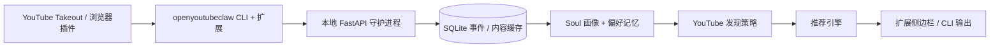

# OpenYouTubeClaw — 架构说明

## 系统概览

YouTube 是唯一受支持的内容源。观看历史导入通过 YouTube Takeout 离线文件或浏览器扩展任务完成；不运行后台账号自动同步或浏览器自动化。

---

## 模块职责

### Soul Engine (`soul/`)
- 行为数据分析和画像构建
- 五层灵魂模型：事件 → 偏好 → 觉察 → 洞察 → 灵魂
- `event_filters` / `satisfaction_filter_enabled` — 偏好分析前过滤 `negative` 事件
- `negative_exemplars` — 从事件层抽取近期 negative 标题，供发现评估做负样本锚点
- `InterestSpeculator` — 兴趣推测与投机性发现
- 苏格拉底式用户对话

### Memory System (`memory/`)
- 多层网状记忆管理（Core / Episodic / Semantic / Working）
- 跨层关联和双向修正
- 自我编辑和遗忘机制

### Content Discovery (`discovery/`)
- YouTube 发现策略：`yt_search` / `yt_trending` / `yt_channel`
- 内容 LLM 评估（基于 Soul 画像批量打分，含负样本锚点压分）
- 候选分层、去重、缓存写入；`pool_status='suppressed'` 候选重发现时自动复活
- 多样性栈：`_compress_topic_repeats` + `trim_topic_group_overflow`（任意 topic_group ≤ 池子 10%）

### Sources (`sources/`)
- `yt_tasks` — YouTube 扩展任务队列（`bootstrap_profile` 任务；观看历史 / 订阅 / 点赞由扩展从 DOM 读取后分批回传）
- `youtube.takeout` — Google Takeout 离线解析器，转换为统一事件
- `SourceAdapter` Protocol / `SourceRecipe` — 源任务持久化与分发

### Recommendation Engine (`recommendation/`)
- 推荐排序与朋友式自然语言表达生成
- `PoolCurator` 五维评分：relevance · freshness · topic_fatigue · source_monotony · serendipity
- 双轴 fatigue：`recent_topic_keys`（细粒度）+ `recent_topic_groups`（粗粒度）
- `_merge_topic_supergroups` — serving 时将近义 topic 合并为聚类
- `batch_insert_recommendations` — 单 transaction 批量插入

### Runtime (`runtime/`)
- 系统生命周期管理和服务编排
- 降级模式启动：LLM 配置错误时保留 `/api/health`、`/api/config`、`/api/runtime-status`，popup 设置页仍可修复配置
- 配置热重载：`RuntimeContext` 重建 registry / service / engine，热重载后 speculator tick 注册为 detached task
- `ContinuousRefreshController` — 后台定时刷新候选池（refresh / pool_precompute / soul_pipeline / proactive_push）
- `background_llm_work_allowed()` — 共享 gate；`scheduler.enabled=false` 暂停后台 LLM/embedding 工作
- `_enforce_pool_cap` — 每 tick 跑 topic_group overflow 修剪 + suppressed 候选复活
- `AccountSyncService` — 兼容桩，YouTube 数据通过扩展 push-based 任务到达，无需定时轮询
- `runtime-stream` — WebSocket 事件流；驱动扩展通知（delight / cognition update / 任务 kick）和 `PresenceTracker`

### FastAPI Backend (`api/`)
- 本地 REST API，端口 8420
- `create_app()` 初始化所有组件
- 接收行为事件、提供推荐、推送实时认知更新

### LLM Providers (`llm/`)
- 统一多模型接口：OpenAI / Claude / Gemini / DeepSeek / Ollama / OpenRouter
- `LLMService` 按 caller bucket 路由 soul / discovery / recommendation / evaluation
- `llm/json_utils.py` — 统一 JSON 容错解析
- `EmbeddingService` — L1 内存 + L2 SQLite 双层缓存

### Storage (`storage/`)
- SQLite 数据库管理（事件、内容缓存、候选池、chat turns、推荐记录）
- 冷备份、完整性检查、显式修复
- `chat_turns` — 侧边栏 durable 对话持久化

### CLI (`cli.py`)
- Typer 入口：`openbiliclaw start / init / recommend / profile / config-show`
- `import-youtube` / `fetch-youtube` — 离线 Takeout 导入与扩展任务触发

### Integration Layer (`integrations/`)
- OpenClaw adapter：将推荐能力暴露为 OpenClaw 可调用 skill
- adapter 不直接访问 SQLite 或内部 engine 细节
- CLI bridge：`python -m openbiliclaw.integrations.openclaw.cli`

---

## 运行时约束

1. **同进程共享单个 SQLite 实例** — `MemoryManager`、`RecommendationEngine`、`ContentDiscoveryEngine` 复用同一个 `Database`。
2. **启动前完整性检查** — `openbiliclaw start` 检查数据库；超过 24 小时未备份则先生成冷备到 `data/backups/`。
3. **数据库修复不自动执行** — 高风险恢复通过 `openbiliclaw db-repair` 手动触发。

---

## Durable Chat（侧边栏持久对话）

popup 对所有聊天 scope（`chat` / `delight` / `probe`）统一调用 `/api/chat/turns`：

1. popup 生成 `turn_id` 并 POST 消息和 scope
2. 后端写入 `chat_turns(status='pending')`，后台任务生成回复
3. popup 轮询 `/api/chat/turns/{turn_id}`，初始化时按 `session/scope` 恢复历史

Chrome 丢弃不可见 side panel 后，仍能恢复 pending 占位、完成回复或失败状态。
