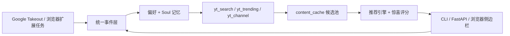

# OpenYouTubeClaw — 项目规格说明书 (SPEC) v0.4

> *你的 YouTube 专属 AI 朋友，比你更懂你想看什么* 🎯

---

## 1. 项目定位

OpenYouTubeClaw 是一个**本地运行的 YouTube 个性化内容推荐 AI Agent**。它建立深度用户心理画像（"Soul"），通过 YouTube 发现策略主动找到你可能喜欢但自己找不到的内容，并给出有温度的朋友式推荐解释。

**核心理念**：
- 不是冷冰冰的推荐算法，而是一个**有温度的 AI 朋友**
- 不是被动过滤推荐流，而是**主动探索发现**
- 不是浅层兴趣匹配，而是**深层理解人格与需求**
- 所有数据**本地处理**，不上传至任何第三方

---

## 2. 数据流



---

## 3. 系统架构

```
┌──────────────────────────────────────────────────────────────┐
│                  用户交互层 (浏览器扩展 + CLI)                   │
│  ┌──────────────┐  ┌──────────────┐  ┌─────────────────┐    │
│  │ YouTube 行为  │  │ 推荐展示 UI   │  │ 对话/反馈交互    │    │
│  │ 采集 + 停留   │  │ (侧边栏)      │  │ (durable turn) │    │
│  └──────────────┘  └──────────────┘  └─────────────────┘    │
│  ┌──────────────────────────────────────────────────────┐   │
│  │ YouTube 任务调度 + 配置离线缓存 + 后台 LLM 暂停开关          │   │
│  └──────────────────────────────────────────────────────┘   │
├──────────────────────────────────────────────────────────────┤
│                      Agent 核心层                             │
│  ┌──────────────┐ ┌──────────────┐ ┌────────────────┐       │
│  │ User Soul    │ │ Content      │ │ Recommendation │       │
│  │ Engine       │ │ Discovery    │ │ Engine         │       │
│  │ (画像+过滤)   │ │ (yt策略+评估) │ │ (排序+表达)     │       │
│  └──────────────┘ └──────────────┘ └────────────────┘       │
│  ┌──────────────────────────────────────────────────────┐   │
│  │ PoolCurator + 双轴 fatigue + ContinuousRefreshController│   │
│  │ LLM gate: scheduler.enabled + extension presence      │   │
│  └──────────────────────────────────────────────────────┘   │
├──────────────────────────────────────────────────────────────┤
│                    YouTube 源适配层                            │
│  ┌─────────────────────┐  ┌──────────────────────────────┐  │
│  │ yt_tasks (扩展桥)    │  │ YouTube Takeout 离线解析器     │  │
│  │ bootstrap / history │  │ watch history / likes / subs  │  │
│  └─────────────────────┘  └──────────────────────────────┘  │
├──────────────────────────────────────────────────────────────┤
│         LLM 适配层 + Embedding 服务（双层缓存）                 │
│  OpenAI / Claude / Gemini / DeepSeek / Ollama / OpenRouter  │
├──────────────────────────────────────────────────────────────┤
│              存储层 (SQLite + JSON + 向量索引)                  │
│  events · content_cache · recommendations · chat_turns      │
└──────────────────────────────────────────────────────────────┘
```

---

## 4. 核心功能模块

### 4.1 🧠 用户灵魂引擎 (Soul Engine)

**目标**：从"他做了什么"到"他为什么这样"到"他是一个什么样的人"。

#### 五层网状记忆架构

```
┌─────────────────────────────────────────────────────────────┐
│                   🌟 灵魂层 (Soul Layer)                     │
│  人格特质 · 核心价值观 · 深层需求 · 生活状态  ↕ 双向修正          │
├─────────────────────────────────────────────────────────────┤
│              💡 洞察层 (Insight Layer)                        │
│  动机分析 · 心理需求推断 · 潜在兴趣假设 · 行为模式归因  ↕ 双向修正  │
├─────────────────────────────────────────────────────────────┤
│              📅 觉察层 (Awareness Layer)                      │
│  每日观察笔记 · 兴趣趋势 · 情绪状态推测 · 阶段性总结  ↕ 双向修正  │
├─────────────────────────────────────────────────────────────┤
│              📊 偏好层 (Preference Layer)                     │
│  兴趣标签(带权重+时间衰减) · 风格偏好 · 情境模式  ↕ 数据提取      │
├─────────────────────────────────────────────────────────────┤
│              📝 事件层 (Event Layer)                          │
│  YouTube 行为日志 · 观看时长 · 点赞/订阅/搜索 · 满意度信号       │
└─────────────────────────────────────────────────────────────┘
```

| 记忆类型 | 对应层 | 存储方式 |
|---------|--------|---------|
| Core Memory | 灵魂层 + 偏好层摘要 | JSON（可自编辑）|
| Episodic Memory | 事件层 + 觉察层 | SQLite + 向量索引 |
| Semantic Memory | 偏好层 + 洞察层 | JSON |
| Working Memory | 运行时 | 内存 |

#### 苏格拉底式用户对话

不只记录用户说了什么，而是主动追问、假设、确认、调整：

```
用户：我最近对 AI 视频有点烦了
Agent：了解。你之前喜欢看 AI 视频是因为工作需要，还是纯粹好奇？
      如果是好奇驱动，也许我可以在别的领域帮你找到类似的"弄懂原理"感？
```

---

### 4.2 🔍 内容发现引擎 (Discovery Engine)

YouTube 发现策略：

| 策略 | 实现 |
|------|------|
| 关键词搜索 | `yt_search` — 根据 Soul 画像生成搜索词 |
| 热门/趋势 | `yt_trending` — 扫描 YouTube 趋势，结合画像筛选 |
| 频道订阅链 | `yt_channel` — 追踪优质频道新动态 |
| 跨领域探索 | `ExploreStrategy` — 刻意推荐用户未接触但画像暗示可能感兴趣的领域 |

内容评估基于用户 Soul 画像 LLM 批量打分，包含近期 negative 标题作为负样本锚点。

---

### 4.3 📬 推荐与呈现

不是：*"因为你观看了相关视频，推荐以下内容"* ❌

而是：*"我觉得你会喜欢这个——这个频道讲 AI 的角度很独特，有点像你喜欢的那种'把复杂的事讲透'的风格。我理解你对 AI 的关注不只是工作需要，更多是一种对未来的好奇，这个视频正好聊到你可能感兴趣的方向。"* ✅

---

### 4.4 🔄 反馈学习系统

- **隐式反馈**：浏览器扩展采集观看时长、满意度信号
- **显式反馈**：点赞/踩、对话式反馈
- **记忆迭代**：反馈触发多层记忆网络更新——事件层记录事实，偏好层调整权重，觉察层写观察笔记，洞察层修正假设，灵魂层在必要时更新人格理解

---

## 5. 关键设计约束

1. **YouTube-only** — 不支持其他内容平台
2. **本地优先** — 所有数据存储在本机 SQLite；LLM 调用可指向本地 Ollama
3. **无后台爬虫** — YouTube 数据通过用户自身浏览器 + Takeout 获取，不走后端爬取
4. **可扩展 LLM** — 支持 OpenAI / Claude / Gemini / DeepSeek / Ollama / OpenRouter，可按 caller 分配不同 provider
5. **提示缓存** — 所有 LLM prompt builder 的 system message 必须静态，确保 provider 端 cache 命中（见 CLAUDE.md LLM Prompt-Cache Convention）
